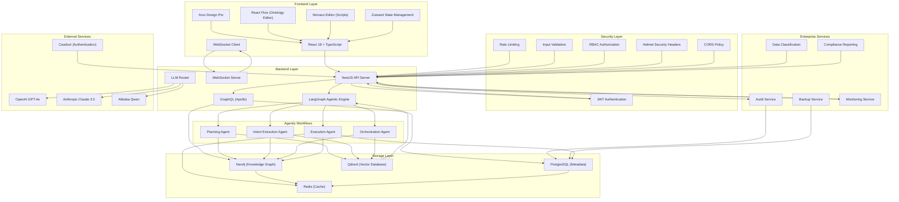

# ZeroCode Ontology Platform (ZCOP)

ZeroCode Ontology Platform (ZCOP) is a revolutionary zero-code business system development framework that allows users to define ontologies through graphical methods, automatically generate knowledge graphs, infer business processes, and operate through natural language interfaces.

## Core Features

### 🧠 Ontology-Driven Development
- Drag-and-drop graphical interface to define entities, properties, relationships, actions and rules
- Real-time generation and maintenance of complete, queryable, version-controlled knowledge graphs
- Support for advanced concepts such as inheritance, polymorphism, composite properties, computed properties, enumerations, etc.
- Support for visual relationship graph editing

### 🤖 Natural Language Business Operations
- Unified ChatUI interface to initiate any business request in natural language
- Automatic intent parsing → matching/dynamic orchestration of business processes → calling Agentic execution engine
- Return structured results + natural language summaries + visual cards/tables/charts
- Support for multi-turn conversations and contextual understanding

### 🔁 Autonomous Planning Engine
- Automatically analyze ontology models and generate corresponding business workflows
- Identify potential business scenarios and create corresponding processing flows
- Support automated workflows for CRUD operations, relationship management, rule application, etc.
- Intelligent generation of cross-entity business processes

### 🔁 Automatic Model Adaptation
- When the ontology model changes, support manual triggering or automatic full replanning
- The system automatically re-reasons all affected business processes, actions, and rules
- Ensure existing business remains continuously available and automatically adapts to new models

### 📊 Graph Analysis and Insights
- Real-time graph statistical analysis (entity distribution, relationship types, property analysis, etc.)
- Business insight recommendations (potential business opportunities, optimization suggestions, etc.)
- Visual graph display and exploration

### 🔐 Enterprise Security & Authentication
- Complete RBAC permission management
- JWT-based authentication with refresh tokens
- Secure password hashing with bcrypt
- Rate limiting to prevent abuse
- Comprehensive logging and audit trails

### 🏗️ Enterprise Architecture
- Complete RBAC permission management
- Multi-tenant support
- Audit logs and data backup
- Self-hostable, commercial-grade deployment
- Support horizontal scaling and high availability deployment
- Health check endpoints for monitoring
- Environment-based configuration management

## Enterprise-Grade Features

### Security & Compliance
- JWT-based authentication with refresh token mechanism
- Role-based access control (RBAC) with granular permissions
- Password encryption with bcrypt
- Rate limiting to prevent API abuse
- Input validation and sanitization
- Security headers (Helmet) to protect against common attacks
- CORS configuration for secure cross-origin requests
- Data encryption and privacy controls

### Data Governance & Compliance
- Comprehensive audit logging system
- Data classification and sensitivity analysis
- GDPR/CCPA compliance tools
- Automated data retention policies
- Data lineage tracking
- Privacy impact assessments

### Monitoring & Observability
- Comprehensive request logging
- Health check endpoints
- Performance monitoring and metrics
- Error tracking and alerting system
- System performance dashboards
- Real-time activity monitoring
- Resource utilization tracking

### Scalability & Performance
- Microservice architecture
- Container-ready with Docker
- Database connection pooling
- Redis caching layer
- Horizontal scaling support
- Load balancing capabilities
- Performance optimization tools

### Configuration Management
- Environment-based configuration
- Centralized configuration management
- Secure credential handling
- Dynamic configuration reloading
- Feature flag management

### Data Protection & Recovery
- Automated backup and recovery system
- Point-in-time recovery capabilities
- Disaster recovery planning
- Data integrity verification
- Backup encryption and compression

## Tech Stack

### Frontend
- **React 18** + **TypeScript** + **Vite**
- **Arco Design Pro** (preferred) or **Ant Design Pro**
- **React Flow** (Ontology Relationship Graph Editing)
- **Monaco Editor** (Action Script/Rule Editing)
- **TailwindCSS** + **Zustand** State Management

### Backend
- **NestJS** (TypeScript)
- **GraphQL** (Apollo Server)
- **TypeORM**
- **Passport.js** + **JWT** (Authentication)
- **WebSocket** (Real-time sync of ontology changes and Agent execution processes)

### Storage
- **Neo4j** (Primary storage, supports Cypher queries)
- **PostgreSQL** (Metadata storage)
- **Redis** (Cache ontology structure and hot data)
- **Qdrant** (Vector database)

### AI & Agentic
- Multi-model routing (OpenAI GPT-4o / Claude 3.5 Sonnet / Qwen, etc.)
- **LangGraph** (recommended) or CrewAI + LangChain to build deterministic, persistent, debuggable Agentic workflows

## Quick Start

### Requirements
- Node.js 18+
- Docker & Docker Compose
- At least 8GB memory

### Installation & Deployment

1. Clone the repository
```bash
git clone https://github.com/caowei8810/zcop.git
cd zcop
```

2. Configure environment variables
```bash
cp .env.example .env
# Edit .env file to configure API keys and other settings
```

3. Start services
```bash
docker-compose -f deploy/docker-compose.yml up -d
```

4. Access the application
- Frontend: http://localhost:5173
- Backend API: http://localhost:3000
- Health Check: http://localhost:3000/api/health
- Metrics: http://localhost:3000/api/metrics/system-stats
- Audit Logs: http://localhost:3000/api/metrics/audit-logs
- Data Governance: http://localhost:3000/api/governance/compliance-report
- Monitoring: http://localhost:3000/api/monitoring/errors
- API Documentation: http://localhost:3000/swagger (development only)

## Usage Examples

### 1. Create Ontology Model
In the ontology builder, create entities, properties, and relationships through drag-and-drop:

```
Entity: Customer
Properties: name (STRING, REQUIRED), email (STRING, UNIQUE), status (ENUM: ['Prospect', 'Lead', 'Customer'])

Entity: Order
Properties: orderNo (STRING, UNIQUE, REQUIRED), amount (NUMBER, REQUIRED), status (ENUM)

Relationship: Customer -> Order (ONE_TO_MANY, "places_orders")
```

### 2. Natural Language Operations
In ChatUI, perform business operations using natural language:

- "Create a new customer named Zhang San with email zhangsan@example.com"
- "Show all customers with status 'Lead'"
- "Create an order for customer Zhang San containing iPhone 15 product"
- "Display all unshipped orders for customer ID 123"
- "Add note 'Priority Processing' to order ORD-001"

### 3. Enterprise Operations
Through the admin interface, manage enterprise features:

- View audit logs: `/api/metrics/audit-logs`
- Generate compliance reports: `/api/governance/compliance-report`
- Monitor system health: `/api/health`
- Perform data backup: `/api/governance/data-backup`
- Classify sensitive data: `/api/governance/data-classification`

### 4. Autonomous Planning
The system automatically analyzes the ontology model and generates corresponding business workflows:
- Customer CRUD operations
- Order processing workflows
- Report generation workflows
- Approval processes, etc.

## System Architecture



## CRM Example

The project includes a complete CRM system example showing how to build actual business systems with ZCOP:

- **Entities**: Customer, Contact, Product, Order, OrderItem, Invoice, Interaction
- **Relationships**: Customer -> Order (One-to-many), Order -> OrderItem (One-to-many), Product -> OrderItem (One-to-many)
- **Business Processes**: Customer management, order processing, invoice generation, interaction tracking, etc.
- **Natural Language Operations**: "Create customer", "Place order", "Generate sales report", etc.

## Enterprise Security & Compliance

### Data Protection
- End-to-end encryption for sensitive data
- Secure key management
- Data anonymization for testing environments
- Regular security audits

### Access Control
- Multi-factor authentication (MFA)
- Single sign-on (SSO) integration
- Role-based permissions
- Session management
- IP whitelisting

### Compliance Standards
- GDPR compliance tools
- CCPA compliance tools
- SOC 2 Type II readiness
- HIPAA compliance (with proper configuration)
- PCI DSS considerations

## Risks and Mitigation

- **Complexity Management**: Provide change impact analysis and sandbox environments
- **Performance**: Intelligent caching, graph partitioning, query optimization
- **Security**: Fine-grained permission control, audit logs
- **AI Reliability**: Human-AI collaboration, execution preview, deterministic fallback
- **Compliance**: Support for major industry regulations
- **Data Loss**: Automated backup and recovery procedures
- **System Availability**: High availability and disaster recovery planning

## Extension Directions

- **Advanced Analytics**: Predictive modeling, anomaly detection, recommendation engines
- **Industry Solutions**: Healthcare, finance, manufacturing domain-specific solutions
- **Collaboration Features**: Real-time collaboration, version control, change approval
- **Integration Capabilities**: Legacy system connectors, API marketplace
- **Mobile Support**: Offline functionality, edge computing

## Contribution

We welcome community contributions! Please follow these guidelines:

1. Fork the repository
2. Create a feature branch
3. Make modifications
4. Submit a pull request with detailed explanation
5. Ensure all tests pass

## License

MIT License - See [LICENSE](LICENSE) file for details

## Support

For support, please:
1. Check the FAQ in the documentation
2. Submit an issue in the GitHub repository
3. Contact the development team through official channels

---

ZCOP aims to enable business personnel to develop enterprise-level systems without coding, achieving a true low-code/zero-code experience through ontology-driven methods.