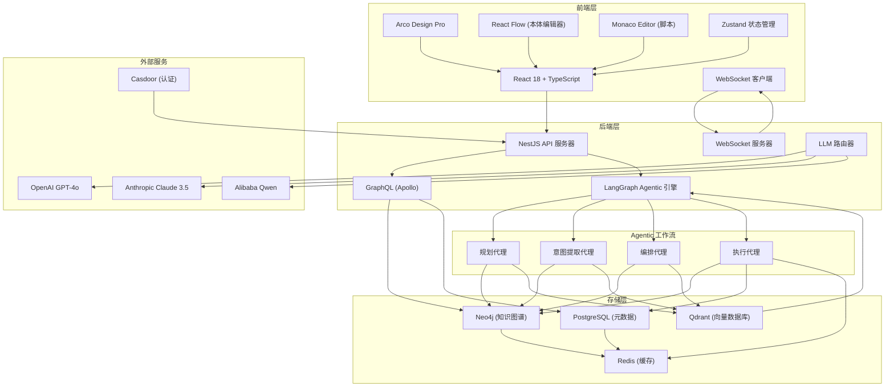

# ZeroCode Ontology Platform (ZCOP)

ZeroCode Ontology Platform (ZCOP) 是一个革命性的零代码业务系统开发框架，允许用户通过图形化方式定义本体论，并自动生成知识图谱、推断业务流程，并通过自然语言界面操作。

## 核心特性

### 🧠 本体驱动开发
- 拖拽式图形化界面定义实体、属性、关系、动作和规则
- 实时生成和维护完整、可查询、可版本化的知识图谱
- 支持继承、多态、复合属性、计算属性、枚举、计算属性等高级概念
- 支持可视化关系图谱编辑

### 🤖 自然语言业务操作
- 统一的ChatUI界面，用自然语言发起任意业务请求
- 自动解析意图 → 匹配/动态编排业务流程 → 调用Agentic执行引擎
- 返回结构化结果 + 自然语言总结 + 可视化卡片/表格/图表
- 支持多轮对话和上下文理解

### 🔁 自主规划引擎
- 自动分析本体模型，生成相应的业务工作流
- 识别潜在业务场景并创建对应的处理流程
- 支持CRUD操作、关系管理、规则应用等自动化工作流
- 智能生成跨实体业务流程

### 🔁 自动模型适应
- 当本体模型发生变动时，支持手动触发或自动全量重新规划
- 系统自动重新推理所有受影响的业务流程、动作、规则
- 保证已有业务持续可用并自动适配新模型

### 📊 图谱分析与洞察
- 实时图谱统计分析（实体分布、关系类型、属性分析等）
- 业务洞察推荐（潜在商业机会、优化建议等）
- 可视化图谱展示与探索

### 🏗️ 企业级架构
- 完整的RBAC权限管理
- 多租户支持
- 审计日志和数据备份
- 可自托管、可商用级部署
- 支持水平扩展和高可用部署

## 技术栈

### 前端
- **React 18** + **TypeScript** + **Vite**
- **Arco Design Pro** (首选) 或 **Ant Design Pro** 
- **React Flow** (本体关系图编辑)
- **Monaco Editor** (动作脚本/规则编辑)
- **TailwindCSS** + **Zustand** 状态管理

### 后端
- **NestJS** (TypeScript)
- **GraphQL** (Apollo Server)
- **TypeORM**
- **WebSocket** (实时同步本体变更与 Agent 执行过程)

### 存储
- **Neo4j** (主存储，支持 Cypher 查询)
- **PostgreSQL** (元数据存储)
- **Redis** (缓存本体结构与热点数据)
- **Qdrant** (向量数据库)

### AI & Agentic
- 多模型路由（OpenAI GPT-4o / Claude 3.5 Sonnet / Qwen 等）
- **LangGraph** (推荐) 或 CrewAI + LangChain 构建确定性、可持久化、可调试的 Agentic 工作流

## 快速开始

### 环境要求
- Node.js 18+
- Docker & Docker Compose
- 至少 8GB 内存

### 安装部署

1. 克隆仓库
```bash
git clone https://github.com/caowei8810/zcop.git
cd zcop
```

2. 配置环境变量
```bash
cp .env.example .env
# 编辑 .env 文件，配置 API 密钥和其他设置
```

3. 启动服务
```bash
docker-compose -f deploy/docker-compose.yml up -d
```

4. 访问应用
- 前端: http://localhost:5173
- 后端 API: http://localhost:3000
- GraphQL Playground: http://localhost:3000/graphql
- Neo4j Browser: http://localhost:7474

## 使用示例

### 1. 创建本体模型
在本体构建器中，通过拖拽方式创建实体、属性和关系：

```
实体: Customer
属性: name (STRING, REQUIRED), email (STRING, UNIQUE), status (ENUM: ['Prospect', 'Lead', 'Customer'])

实体: Order
属性: orderNo (STRING, UNIQUE, REQUIRED), amount (NUMBER, REQUIRED), status (ENUM)

关系: Customer -> Order (ONE_TO_MANY, "places_orders")
```

### 2. 自然语言操作
在ChatUI中，使用自然语言进行业务操作：

- "创建一个名为张三的新客户，邮箱是zhangsan@example.com"
- "显示所有状态为'Lead'的客户"
- "为客户张三创建一个订单，包含iPhone 15产品"
- "显示客户ID为123的所有未发货订单"
- "为订单ORD-001添加备注'优先处理'"

### 3. 自主规划
系统会自动分析本体模型，生成相应的业务工作流：
- 客户CRUD操作
- 订单处理流程
- 报表生成工作流
- 审批流程等

## 系统架构



## CRM 示例

项目包含了完整的CRM系统示例，展示了如何使用ZCOP构建实际业务系统：

- **实体**: Customer, Contact, Product, Order, OrderItem, Invoice, Interaction
- **关系**: Customer -> Order (一对多), Order -> OrderItem (一对多), Product -> OrderItem (一对多)
- **业务流程**: 客户管理、订单处理、发票生成、交互跟踪等
- **自然语言操作**: "创建客户"、"下订单"、"生成销售报告"等

## 风险与缓解

- **复杂性管理**: 提供变更影响分析和沙盒环境
- **性能**: 智能缓存、图分区、查询优化
- **安全性**: 细粒度权限控制、审计日志
- **AI可靠性**: 人机协作、执行预览、确定性回退
- **合规性**: 支持主要行业法规

## 扩展方向

- **高级分析**: 预测建模、异常检测、推荐引擎
- **行业解决方案**: 医疗、金融、制造等领域特定方案
- **协作功能**: 实时协作、版本控制、变更审批
- **集成能力**: 遗留系统连接器、API市场
- **移动支持**: 离线功能、边缘计算

## 贡献

我们欢迎社区贡献！请遵循以下指南：

1. Fork 仓库
2. 创建功能分支
3. 进行修改
4. 提交带有详细说明的 Pull Request
5. 确保所有测试通过

## 许可证

MIT License - 详见 [LICENSE](LICENSE) 文件

## 支持

如需支持，请：
1. 查看文档中的常见问题解答
2. 在 GitHub 仓库中提交问题
3. 通过官方渠道联系开发团队

---

ZCOP 旨在让业务人员无需编码即可开发企业级系统，通过本体驱动的方法实现真正的低代码/零代码体验。