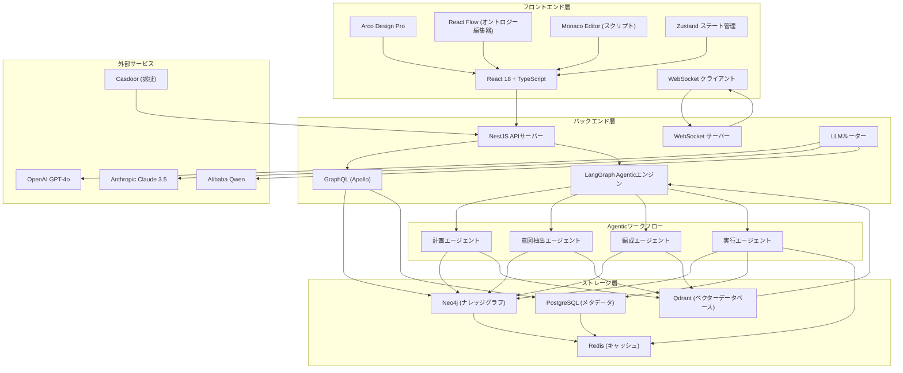

# ZeroCode Ontology Platform (ZCOP)

ZeroCode Ontology Platform (ZCOP) は、グラフィカルな方法でオントロジーを定義し、ナレッジグラフを自動生成し、ビジネスプロセスを推論し、自然言語インターフェースで操作できる革新的なゼロコードビジネスシステム開発フレームワークです。

## 主な特徴

### 🧠 オントロジー駆動開発
- ドラッグアンドドロップ式グラフィカルインターフェースでエンティティ、プロパティ、リレーション、アクション、ルールを定義
- 完全でクエリ可能でバージョン管理可能なナレッジグラフをリアルタイム生成・維持
- 継承、ポリモーフィズム、複合プロパティ、計算プロパティ、列挙、計算プロパティなどの上級概念をサポート
- 可視化リレーションシップグラフエディットをサポート

### 🤖 自然言語ビジネス操作
- 統一されたChatUIインターフェースで、自然言語で任意のビジネスリクエストを発行
- 意図自動解析 → ビジネスプロセス照合/動的編成 → Agentic実行エンジン呼び出し
- 構造化された結果 + 自然言語サマリー + ビジュアライゼーションカード/テーブル/チャートを返却
- マルチターン対話とコンテキスト理解をサポート

### 🔁 自律計画エンジン
- オントロジーモデル自動分析により、対応するビジネスワークフローを生成
- 潜在的ビジネスシナリオを識別し、対応する処理プロセスを作成
- CRUD操作、リレーションシップ管理、ルール適用などの自動化ワークフローをサポート
- エンティティ間ビジネスプロセスをインテリジェントに生成

### 🔁 自動モデル適応
- オントロジーモデルが変更された場合、手動トリガーまたは自動全量再計画をサポート
- システムは影響を受けるすべてのビジネスプロセス、アクション、ルールを自動的に再推論
- 既存ビジネスの継続的可用性を保証し、新しいモデルに自動適応

### 📊 グラフ分析と洞察
- リアルタイムグラフ統計分析（エンティティ分布、リレーションタイプ、プロパティ分析など）
- ビジネスインサイト推奨（潜在的ビジネスチャンス、最適化提案など）
- 可視化グラフ表示と探索

### 🏗️ エンタープライズアーキテクチャ
- 完全なRBAC権限管理
- マルチテナンシー対応
- 監査ログとデータバックアップ
- セルフホスティング・商用利用可能デプロイメント
- 水平スケーリングとハイアベイラビリティデプロイメントをサポート

## 技術スタック

### フロントエンド
- **React 18** + **TypeScript** + **Vite**
- **Arco Design Pro** (優先) または **Ant Design Pro**
- **React Flow** (オントロジーリレーションシップ図エディット)
- **Monaco Editor** (アクションスクリプト/ルールエディット)
- **TailwindCSS** + **Zustand** ステート管理

### バックエンド
- **NestJS** (TypeScript)
- **GraphQL** (Apollo Server)
- **TypeORM**
- **WebSocket** (リアルタイム同期オントロジー変更とAgent実行情報)

### ストレージ
- **Neo4j** (主ストレージ、Cypherクエリ対応)
- **PostgreSQL** (メタデータストレージ)
- **Redis** (オントロジー構造とホットデータキャッシュ)
- **Qdrant** (ベクターデータベース)

### AI & Agentic
- マルチモデルルーティング（OpenAI GPT-4o / Claude 3.5 Sonnet / Qwen など）
- **LangGraph** (推奨) または CrewAI + LangChain で決定的、永続的、デバッグ可能なAgenticワークフロー構築

## クイックスタート

### 環境要件
- Node.js 18+
- Docker & Docker Compose
- 少なくとも 8GB メモリ

### インストール・デプロイメント

1. リポジトリをクローン
```bash
git clone https://github.com/caowei8810/zcop.git
cd zcop
```

2. 環境変数を設定
```bash
cp .env.example .env
# .env ファイルを編集し、APIキーとその他の設定を構成
```

3. サービスを起動
```bash
docker-compose -f deploy/docker-compose.yml up -d
```

4. アプリケーションにアクセス
- フロントエンド: http://localhost:5173
- バックエンドAPI: http://localhost:3000
- GraphQL Playground: http://localhost:3000/graphql
- Neo4j Browser: http://localhost:7474

## 使用例

### 1. オントロジーモデル作成
オントロジービルダーで、ドラッグアンドドロップでエンティティ、プロパティ、リレーションを生成：

```
エンティティ: Customer
プロパティ: name (STRING, REQUIRED), email (STRING, UNIQUE), status (ENUM: ['Prospect', 'Lead', 'Customer'])

エンティティ: Order
プロパティ: orderNo (STRING, UNIQUE, REQUIRED), amount (NUMBER, REQUIRED), status (ENUM)

リレーション: Customer -> Order (ONE_TO_MANY, "places_orders")
```

### 2. 自然言語操作
ChatUIで、自然言語でビジネス操作を実行：

- "名前が張三の新規顧客を作成し、メールアドレスはzhangsan@example.com"
- "状態が'Lead'であるすべての顧客を表示"
- "張三様にiPhone 15製品を注文させる"
- "顧客ID 123のすべての未出荷注文を表示"
- "注文ORD-001に備考'優先処理'を追加"

### 3. 自律計画
システムは自動的にオントロジーモデルを分析し、対応するビジネスワークフローを生成：
- 顧客CRUD操作
- 注文処理プロセス
- レポート生成ワークフロー
- 承認プロセスなど

## システムアーキテクチャ



## CRM例

プロジェクトには、ZCOPで実際のビジネスシステムを構築する方法を示す完全なCRMシステム例が含まれています：

- **エンティティ**: Customer, Contact, Product, Order, OrderItem, Invoice, Interaction
- **リレーション**: Customer -> Order (一対多), Order -> OrderItem (一対多), Product -> OrderItem (一対多)
- **ビジネスプロセス**: 顧客管理、注文処理、請求書生成、インタラクション追跡など
- **自然言語操作**: "顧客作成"、"注文下す"、"販売レポート生成"など

## リスクと緩和策

- **複雑性管理**: 変更影響分析とサンドボックス環境を提供
- **パフォーマンス**: インテリジェントキャッシュ、グラフ分割、クエリ最適化
- **セキュリティ**: 細かい権限制御、監査ログ
- **AI信頼性**: 人間とAI協調、実行プレビュー、決定的フォールバック
- **コンプライアンス**: 主要業界規制への対応

## 拡張方向

- **上級分析**: 予測モデリング、異常検知、推薦エンジン
- **業界ソリューション**: 医療、金融、製造などの分野特化ソリューション
- **コラボレーション機能**: リアルタイム共同作業、バージョン管理、変更承認
- **統合能力**: 遺産システムコネクタ、APIマーケット
- **モバイル対応**: オフライン機能、エッジコンピューティング

## 貢献

コミュニティの貢献を歓迎します！以下のガイドラインに従ってください：

1. リポジトリをフォーク
2. 機能ブランチを作成
3. 変更を実施
4. 詳細な説明付きでプルリクエストを提出
5. すべてのテストが通過することを確認

## ライセンス

MIT License - 詳細は [LICENSE](LICENSE) ファイルを参照

## サポート

サポートが必要な場合は：
1. ドキュメントのFAQを確認
2. GitHubリポジトリで問題を提出
3. 公式チャネルで開発チームに連絡

---

ZCOPは、オントロジー駆動手法により、ビジネス担当者がコーディング不要でエンタープライズシステムを開発できるようにすることを目的としています。