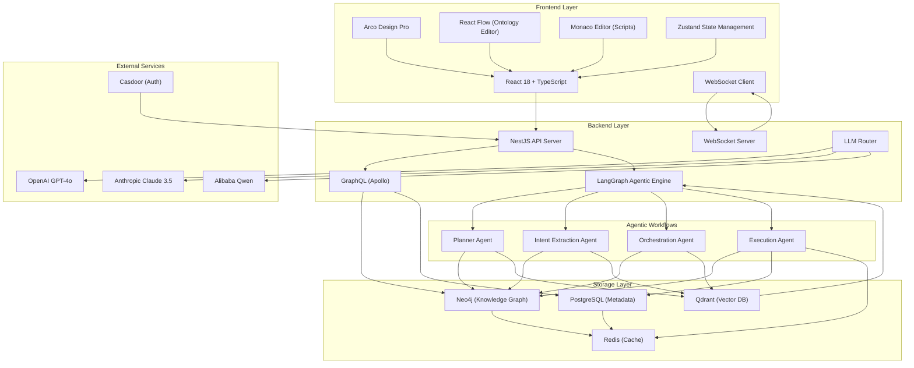

# ZeroCode Ontology Platform (ZCOP) - Deployment Guide

## Overview

ZeroCode Ontology Platform (ZCOP) is a revolutionary zero-code business system development framework that allows users to define ontologies graphically and automatically generates knowledge graphs, infers business processes, and enables natural language operations.

## Architecture



## Core Components

### 1. Ontology Builder
- Drag-and-drop interface for defining entities, properties, relations, actions, and rules
- Real-time knowledge graph visualization
- Version management with diff visualization and rollback

### 2. Agentic Engine
- Planner Agent: Automatically generates business processes from ontology
- Intent Extraction Agent: Parses natural language requests
- Orchestration Agent: Matches requests to business processes
- Execution Agent: Executes workflows via LangGraph

### 3. Knowledge Graph Storage
- Neo4j for primary knowledge graph storage
- PostgreSQL for metadata and configuration
- Redis for caching
- Qdrant for vector storage

## Installation

### Prerequisites

- Docker & Docker Compose
- Node.js 18+ (for local development)
- At least 8GB RAM recommended

### Quick Start

1. Clone the repository:
```bash
git clone https://github.com/caowei8810/zcop.git
cd zcop
```

2. Set up environment variables:
```bash
cp .env.example .env
# Edit .env with your API keys and settings
```

3. Start the services:
```bash
docker-compose -f deploy/docker-compose.yml up -d
```

4. Access the application:
- Frontend: http://localhost:5173
- Backend API: http://localhost:3000
- GraphQL Playground: http://localhost:3000/graphql
- Neo4j Browser: http://localhost:7474
- Adminer: http://localhost:8080

## Configuration

### Environment Variables

#### LLM Configuration
- `OPENAI_API_KEY`: OpenAI API key for GPT models
- `ANTHROPIC_API_KEY`: Anthropic API key for Claude models
- `QDRANT_API_KEY`: Qdrant API key (if using cloud version)

#### Database Configuration
- `DB_HOST`: PostgreSQL host (default: postgres)
- `DB_PORT`: PostgreSQL port (default: 5432)
- `DB_USERNAME`: PostgreSQL username
- `DB_PASSWORD`: PostgreSQL password
- `DB_NAME`: PostgreSQL database name

#### Neo4j Configuration
- `NEO4J_HOST`: Neo4j host (default: neo4j)
- `NEO4J_PORT`: Neo4j port (default: 7687)
- `NEO4J_USERNAME`: Neo4j username
- `NEO4J_PASSWORD`: Neo4j password

#### Authentication Configuration
- `CASDOOR_ENDPOINT`: Casdoor endpoint
- `CASDOOR_CLIENT_ID`: Casdoor client ID
- `CASDOOR_CLIENT_SECRET`: Casdoor client secret

## Usage Guide

### 1. Creating Your First Ontology

1. Log in to the platform
2. Navigate to the "Ontology Builder" section
3. Create your first entity (e.g., "Customer")
4. Add properties to your entity (name, email, etc.)
5. Define relationships between entities
6. Save your ontology

### 2. Using the Natural Language Interface

1. Go to the "ChatUI" section
2. Describe your business operation in natural language:
   - "Create a new customer named John Doe"
   - "Show me all customers from New York"
   - "Generate a sales report for this month"
3. The system will automatically parse your request and execute the appropriate workflow

### 3. Autonomous Planning

1. Go to the "Autonomous Planning" section
2. Click "Run Planning" to automatically generate business processes from your ontology
3. Review and approve the generated workflows
4. The system will automatically update to support new business operations

## Database Schema

### PostgreSQL Tables

#### entity_definitions
- id: UUID (Primary Key)
- name: VARCHAR (Unique)
- displayName: VARCHAR
- description: TEXT
- icon: VARCHAR
- color: VARCHAR
- isActive: BOOLEAN (Default: true)
- createdAt: TIMESTAMP
- updatedAt: TIMESTAMP

#### property_definitions
- id: UUID (Primary Key)
- name: VARCHAR
- displayName: VARCHAR
- description: TEXT
- type: VARCHAR (Enum: STRING, NUMBER, BOOLEAN, DATE, DATETIME, ENUM, REFERENCE, ARRAY, OBJECT)
- required: BOOLEAN (Default: false)
- unique: BOOLEAN (Default: false)
- indexed: BOOLEAN (Default: false)
- validationRules: JSON
- defaultValue: JSON
- enumValues: TEXT[]
- entityId: UUID (Foreign Key to entity_definitions)
- isActive: BOOLEAN (Default: true)
- createdAt: TIMESTAMP
- updatedAt: TIMESTAMP

#### relation_definitions
- id: UUID (Primary Key)
- name: VARCHAR
- displayName: VARCHAR
- description: TEXT
- relationType: VARCHAR (Enum: ONE_TO_ONE, ONE_TO_MANY, MANY_TO_ONE, MANY_TO_MANY)
- fromCardinality: VARCHAR (Enum: ONE, ZERO_OR_ONE, MANY, ZERO_OR_MANY)
- toCardinality: VARCHAR (Enum: ONE, ZERO_OR_ONE, MANY, ZERO_OR_MANY)
- fromEntityId: UUID (Foreign Key to entity_definitions)
- toEntityId: UUID (Foreign Key to entity_definitions)
- properties: JSON
- isActive: BOOLEAN (Default: true)
- createdAt: TIMESTAMP
- updatedAt: TIMESTAMP

### Neo4j Schema

The Neo4j graph schema dynamically reflects the ontology definitions:

- Nodes represent entities with labels matching entity names
- Properties on nodes correspond to entity property definitions
- Relationships between nodes correspond to relation definitions

Example:
```
(Customer:CUSTOMER {id: "uuid", name: "John Doe", email: "john@example.com"})
-[:PLACES_ORDER]->
(Order:ORDER {id: "uuid", orderNo: "ORD-001", amount: 100.0})
```

## Agentic Workflows

### Planner Agent Prompt Template

The Planner Agent uses the following prompt template to generate business workflows:

```
You are an ontology analysis expert. Your task is to analyze the provided ontology and generate appropriate business workflows.

Ontology:
{ontology_json}

Based on this ontology, generate business workflows for common operations:
1. CRUD operations for each entity
2. Operations involving relationships between entities
3. Complex business processes that combine multiple entities

For each workflow, provide:
- Name and description
- Required inputs
- Execution steps
- Expected outputs
- Error handling procedures
```

### Few-Shot Examples

#### Example 1: Customer-Order Domain
Input Ontology:
```
{
  "entities": [
    {
      "name": "Customer",
      "properties": [{"name": "name", "type": "STRING"}, {"name": "email", "type": "STRING"}]
    },
    {
      "name": "Order", 
      "properties": [{"name": "orderNo", "type": "STRING"}, {"name": "amount", "type": "NUMBER"}]
    }
  ],
  "relations": [
    {
      "name": "places_order",
      "fromEntity": "Customer",
      "toEntity": "Order",
      "relationType": "ONE_TO_MANY"
    }
  ]
}
```

Generated Workflows:
- Create Customer
- Update Customer Details
- Place Order for Customer
- Get Customer Orders
- Calculate Customer Lifetime Value

#### Example 2: Employee-Project Domain
Input Ontology:
```
{
  "entities": [
    {
      "name": "Employee",
      "properties": [{"name": "name", "type": "STRING"}, {"name": "department", "type": "STRING"}]
    },
    {
      "name": "Project",
      "properties": [{"name": "name", "type": "STRING"}, {"name": "budget", "type": "NUMBER"}]
    }
  ],
  "relations": [
    {
      "name": "works_on",
      "fromEntity": "Employee", 
      "toEntity": "Project",
      "relationType": "MANY_TO_MANY"
    }
  ]
}
```

Generated Workflows:
- Assign Employee to Project
- Remove Employee from Project
- Get Employees by Project
- Get Projects by Employee
- Calculate Project Resource Allocation

#### Example 3: Product-Category Domain
Input Ontology:
```
{
  "entities": [
    {
      "name": "Product",
      "properties": [{"name": "name", "type": "STRING"}, {"name": "price", "type": "NUMBER"}]
    },
    {
      "name": "Category",
      "properties": [{"name": "name", "type": "STRING"}, {"name": "description", "type": "STRING"}]
    }
  ],
  "relations": [
    {
      "name": "belongs_to",
      "fromEntity": "Product",
      "toEntity": "Category", 
      "relationType": "MANY_TO_ONE"
    }
  ]
}
```

Generated Workflows:
- Add Product to Category
- Move Product Between Categories
- Get Products by Category
- Calculate Category Revenue
- Find Top Categories by Revenue

## LangGraph Workflow Engine

The execution engine uses LangGraph to create deterministic, persistent, and debuggable workflows:

```typescript
import { createGraph, executeWorkflow } from '../workflow/graph-engine';

// Example workflow definition
const workflowDefinition = {
  type: 'sequence',
  steps: [
    {
      id: 'validate-input',
      type: 'validation',
      description: 'Validate input data against entity schema'
    },
    {
      id: 'create-entity',
      type: 'action',
      description: 'Create the entity in the knowledge graph',
      action: 'create-entity',
      params: {
        entityType: '{{inputs.entityType}}',
        entityData: '{{inputs.data}}'
      }
    },
    {
      id: 'update-knowledge-graph',
      type: 'action',
      description: 'Update knowledge graph with new entity',
      action: 'update-knowledge-graph',
      params: {
        nodeId: '{{create-entity.output.id}}',
        nodeData: '{{inputs.data}}'
      }
    }
  ]
};
```

## Security Considerations

1. **API Key Management**: Store LLM API keys securely and rotate regularly
2. **Authentication**: All endpoints require authentication via Casdoor
3. **Authorization**: Role-based access control for ontology elements
4. **Data Isolation**: Multi-tenant support with schema isolation
5. **Input Validation**: All user inputs are validated against ontology schemas
6. **Sanitization**: Generated code and queries are sanitized before execution

## Performance Optimization

1. **Caching**: Extensive use of Redis for caching ontology structures
2. **Indexing**: Proper indexing on PostgreSQL and Neo4j for query performance
3. **Connection Pooling**: Database connection pooling for efficient resource usage
4. **CDN**: Frontend assets served via CDN for faster loading
5. **Compression**: Gzip compression for API responses

## Monitoring and Logging

1. **Application Logs**: Structured logging for debugging and monitoring
2. **Performance Metrics**: Response times, error rates, and throughput metrics
3. **Business Analytics**: Usage patterns and workflow success rates
4. **System Health**: Database connectivity, cache hit rates, and resource utilization

## Scaling Considerations

1. **Horizontal Scaling**: Stateless backend services can be scaled horizontally
2. **Database Scaling**: PostgreSQL read replicas and Neo4j causal clustering
3. **Caching Strategy**: Distributed Redis cluster for high availability
4. **Load Balancing**: Reverse proxy with load balancing capabilities
5. **CDN Integration**: Static assets served via CDN

## Troubleshooting

### Common Issues

1. **Database Connection Errors**
   - Check environment variables for correct database credentials
   - Verify database services are running

2. **LLM API Errors**
   - Verify API keys are correctly set
   - Check network connectivity to LLM providers

3. **Performance Issues**
   - Monitor database query performance
   - Check cache hit/miss ratios
   - Review system resource utilization

### Diagnostic Commands

```bash
# Check service status
docker-compose -f deploy/docker-compose.yml ps

# View application logs
docker-compose -f deploy/docker-compose.yml logs backend

# Check database connectivity
docker-compose -f deploy/docker-compose.yml exec postgres psql -U zcop_user -d zcop_db -c "SELECT 1;"
```

## Backup and Recovery

1. **Database Backups**: Regular automated backups of PostgreSQL and Neo4j
2. **Configuration Backups**: Version control for all configuration files
3. **Disaster Recovery**: Procedures for rapid system recovery
4. **Data Export**: Export functionality for ontology definitions and knowledge graphs

## Roadmap

1. **Advanced Analytics**: Enhanced reporting and visualization capabilities
2. **Mobile Support**: Native mobile applications for iOS and Android
3. **Integration Hub**: Pre-built connectors for popular business applications
4. **AI Enhancement**: Advanced reasoning and inference capabilities
5. **Collaboration Features**: Team-based ontology development and management
6. **Plugin System**: Extensible architecture for custom functionality
7. **Industry Templates**: Pre-built ontologies for common business domains

## Support

For support, please:
1. Check the FAQ section in the documentation
2. Open an issue in the GitHub repository
3. Contact the development team through the official channels

## Contributing

We welcome contributions to the ZCOP project. Please follow these guidelines:
1. Fork the repository
2. Create a feature branch
3. Make your changes
4. Submit a pull request with detailed explanation
5. Ensure all tests pass before submitting

## License

MIT License - see the LICENSE file for details.